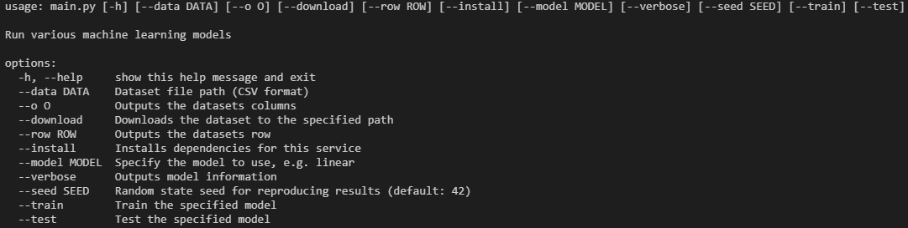

# uwe-enterprise-mlaas-models
A repository containing each machine learning model used in the UWE Enterprise MLAAS.

# Terminal Options
For training, testing, downloading, or viewing the models and output, please use the terminal provided in `main.py`:

## Commands
You can write complex commands. An example is below:
- `py main.py --data path/to/data/data.csv --o cols --download`

This will locate the synthetic data, provide an output, then download the processed data into the same directory.